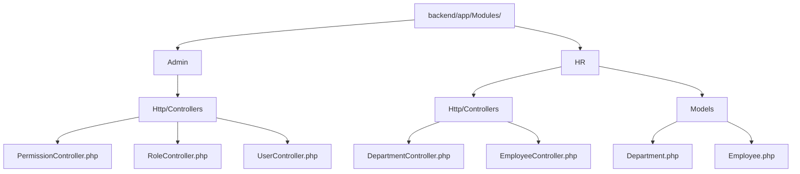
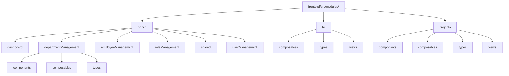
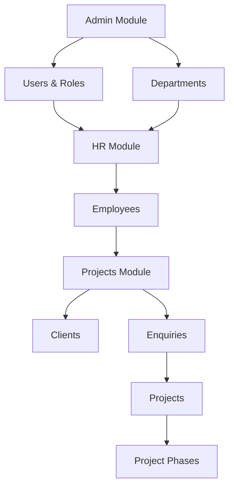

# Module Folder Structure Documentation

## Overview

This document provides a comprehensive breakdown of the folder structures for the Admin, HR, and Projects modules in both the backend (Laravel) and frontend (Vue.js) applications. It includes internal organization, file types, relationships, and naming conventions.

## Backend Module Structure

### Admin Module
**Location:** `backend/app/Modules/Admin/`

```
Admin/
├── Http/
│   └── Controllers/
│       ├── PermissionController.php
│       ├── RoleController.php
│       └── UserController.php
```

**File Types:**
- **Controllers:** PHP classes handling HTTP requests for permissions, roles, and users
- **Features:** CRUD operations for system administration entities

**Key Characteristics:**
- Uses Spatie Permission package for role-based access control
- Controllers follow RESTful conventions with index, show, store, update, destroy methods
- JSON responses with consistent structure

### HR Module
**Location:** `backend/app/Modules/HR/`

```
HR/
├── Http/
│   └── Controllers/
│       ├── DepartmentController.php
│       └── EmployeeController.php
├── Models/
│   ├── Department.php
│   └── Employee.php
```

**File Types:**
- **Controllers:** PHP classes for department and employee management
- **Models:** Eloquent models with relationships and business logic

**Key Characteristics:**
- Full CRUD operations with validation
- Relationships: Departments have managers and employees
- Pagination and filtering support
- Soft delete protection for departments with employees

### Projects Module
**Note:** No backend Projects module currently exists. This may be implemented in future development phases.

## Frontend Module Structure

### Admin Module
**Location:** `frontend/src/modules/admin/`

```
admin/
├── dashboard/
│   └── AdminDashboard.vue
├── departmentManagement/
│   ├── DepartmentManagement.vue
│   ├── components/
│   │   └── DepartmentForm.vue
│   ├── composables/
│   │   └── useDepartments.ts
│   └── types/
│       └── department.ts
├── employeeManagement/
│   ├── EmployeeManagement.vue
│   ├── composables/
│   │   └── useEmployees.ts
│   └── types/
│       └── employee.ts
├── roleManagement/
│   ├── RoleManagement.vue
│   ├── composables/
│   │   └── useRoles.ts
│   └── types/
│       └── role.ts
├── shared/
│   ├── composables/
│   │   └── useApi.ts
│   └── types/
│       └── common.ts
└── userManagement/
    ├── UserManagement.vue
    ├── components/
    │   └── UserForm.vue
    ├── composables/
    │   └── useUsers.ts
    └── types/
        └── user.ts
```

**File Types:**
- **Views (.vue):** Main page components for each management section
- **Components (.vue):** Reusable UI components (forms, etc.)
- **Composables (.ts):** Vue 3 composition functions for data management
- **Types (.ts):** TypeScript interfaces and type definitions

### HR Module
**Location:** `frontend/src/modules/hr/`

```
hr/
├── composables/
│   ├── useEmployees.ts
│   └── useUsers.ts
├── types/
│   └── employee.ts
└── views/
    ├── EmployeeManagement.vue
    └── HRDashboard.vue
```

**File Types:**
- **Views (.vue):** Dashboard and management pages
- **Composables (.ts):** Data fetching and state management
- **Types (.ts):** Employee data structures

### Projects Module
**Location:** `frontend/src/modules/projects/`

```
projects/
├── components/
│   ├── QuickActions.vue
│   ├── WorkflowGuide.vue
│   └── WorkflowStep.vue
├── composables/
│   ├── useClients.ts
│   ├── useEnquiries.ts
│   ├── useProjectPhases.ts
│   └── useProjects.ts
├── types/
│   ├── client.ts
│   ├── enquiry.ts
│   ├── index.ts
│   ├── materials.ts
│   ├── project.ts
│   ├── quotation.ts
│   └── siteSurvey.ts
└── views/
    ├── ClientsManagement.vue
    ├── EnquiriesManagement.vue
    ├── EnquiryDetailWorkflow.vue
    ├── MaterialsManagement.vue
    ├── ProjectsDashboard.vue
    ├── ProjectsManagement.vue
    ├── SiteSurveysManagement.vue
```

**File Types:**
- **Views (.vue):** Management pages for different project aspects
- **Components (.vue):** Workflow and action components
- **Composables (.ts):** Specialized data management for project lifecycle
- **Types (.ts):** Comprehensive type definitions for project entities

## Module Hierarchies

### Backend Module Hierarchy


### Frontend Module Hierarchy


## Relationships Between Modules

### Data Flow Relationships


### Key Relationships:
1. **Admin → HR:** Admin manages departments and user roles that HR uses for employee assignments
2. **HR → Projects:** Employees from HR are assigned to projects
3. **Projects Flow:** Clients → Enquiries → Projects → Phases
4. **Shared Resources:** Common types and API utilities shared across modules

## Naming Conventions

### File Naming
- **Views:** PascalCase with descriptive names (e.g., `AdminDashboard.vue`, `EmployeeManagement.vue`)
- **Components:** PascalCase (e.g., `DepartmentForm.vue`, `QuickActions.vue`)
- **Composables:** camelCase with `use` prefix (e.g., `useEmployees.ts`, `useProjects.ts`)
- **Types:** camelCase matching the entity (e.g., `employee.ts`, `project.ts`)
- **Backend Controllers:** PascalCase with `Controller` suffix (e.g., `DepartmentController.php`)
- **Backend Models:** PascalCase (e.g., `Department.php`)

### Directory Naming
- **Modules:** lowercase (e.g., `admin`, `hr`, `projects`)
- **Subdirectories:** camelCase for feature-specific folders (e.g., `departmentManagement`, `userManagement`)
- **Special folders:** lowercase (e.g., `components`, `composables`, `types`, `views`)

## Organization Principles

### Separation of Concerns
- **Views:** Presentation logic and user interactions
- **Components:** Reusable UI elements
- **Composables:** Business logic and data management
- **Types:** Data structure definitions

### Feature-Based Organization
- Each module encapsulates related functionality
- Clear boundaries between admin, HR, and projects domains
- Shared utilities in dedicated folders

### Consistency Across Modules
- Similar structure patterns across all modules
- Standardized naming conventions
- Consistent API response formats
- Reusable composables and components

### Scalability Considerations
- Modular structure allows easy addition of new features
- TypeScript provides type safety and better IDE support
- Composition API enables reusable logic
- Clear separation facilitates testing and maintenance

This modular architecture ensures maintainability, scalability, and clear separation of business domains while maintaining consistency across the application.