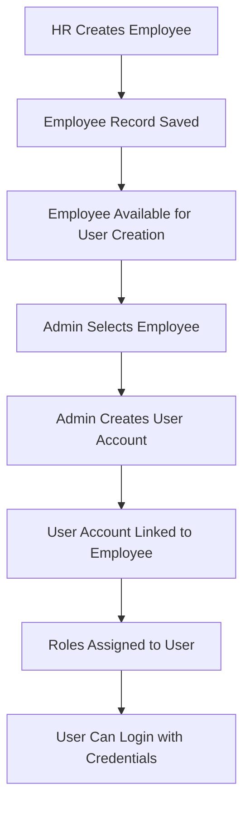
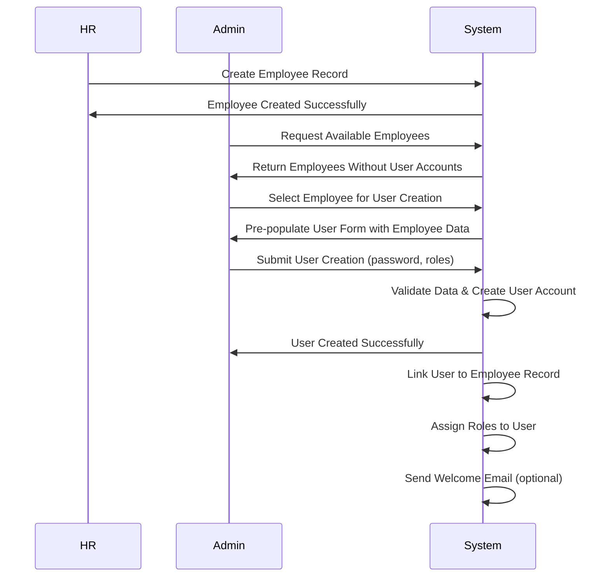
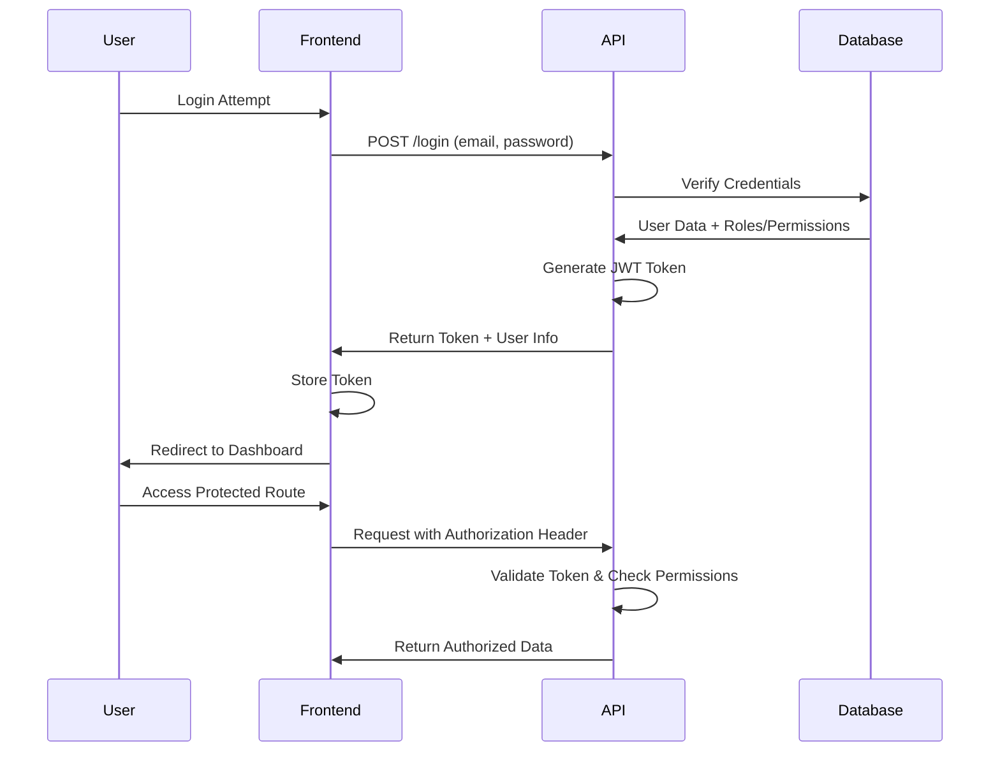

# Employee-User Management System Architecture

## Overview

This document outlines the architecture for a comprehensive employee-user management system where HR creates employee records and Admin creates corresponding system user accounts with role-based access control.

## Current System Architecture

### Database Schema

#### Core Tables

**Users Table**
- `id` (Primary Key)
- `name` (string)
- `email` (string, unique)
- `password` (hashed)
- `employee_id` (Foreign Key to employees, nullable)
- `department_id` (Foreign Key to departments, nullable)
- `is_active` (boolean, default true)
- `last_login_at` (timestamp, nullable)
- `created_at`, `updated_at`

**Employees Table**
- `id` (Primary Key)
- `first_name` (string)
- `last_name` (string)
- `email` (string, unique)
- `phone` (string, nullable)
- `department_id` (Foreign Key to departments)
- `position` (string)
- `hire_date` (date)
- `salary` (decimal)
- `status` (enum: active, inactive, terminated)
- `created_at`, `updated_at`

**Departments Table**
- `id` (Primary Key)
- `name` (string, unique)
- `description` (text, nullable)
- `manager_id` (Foreign Key to employees, nullable)
- `budget` (decimal, nullable)
- `location` (string, nullable)
- `created_at`, `updated_at`

#### RBAC Tables (Spatie Permission Package)

**Roles Table**
- `id` (Primary Key)
- `name` (string)
- `guard_name` (string)
- `description` (text, nullable)
- `created_at`, `updated_at`

**Permissions Table**
- `id` (Primary Key)
- `name` (string)
- `guard_name` (string)
- `created_at`, `updated_at`

**Role-Permission Relationships**
- `role_has_permissions` (many-to-many)
- `model_has_roles` (polymorphic many-to-many)
- `model_has_permissions` (polymorphic many-to-many)

### Current Data Flow



### Key Relationships

1. **Employee-Department**: One-to-Many (Employee belongs to Department)
2. **Department-Manager**: One-to-One (Department has one Manager via manager_id)
3. **User-Employee**: One-to-One (User linked to Employee via employee_id)
4. **User-Department**: Many-to-One (Users belong to Department)
5. **User-Roles**: Many-to-Many (Users can have multiple roles)
6. **Role-Permissions**: Many-to-Many (Roles have multiple permissions)

## Proposed Architecture Improvements

### Enhanced User-Employee Relationship Model

#### Business Rules

1. **Employee Creation**: HR creates employee records with basic information
2. **User Account Creation**: Admin creates user accounts from existing employee records
3. **One-to-One Relationship**: Each employee can have at most one user account
4. **Department Consistency**: User department should match employee department
5. **Email Uniqueness**: Employee email must be unique across system
6. **Status Synchronization**: User active status should reflect employee status

#### Data Integrity Constraints

```sql
-- Ensure employee emails are unique
ALTER TABLE employees ADD CONSTRAINT unique_employee_email UNIQUE (email);

-- Ensure user-employee relationship integrity
ALTER TABLE users ADD CONSTRAINT fk_user_employee
FOREIGN KEY (employee_id) REFERENCES employees(id) ON DELETE SET NULL;

-- Ensure department consistency (trigger or application logic)
-- User department should match employee department when employee_id is set
```

### Role-Based Access Control (RBAC) Structure

#### Proposed Role Hierarchy

**Super Admin**
- Full system access
- Can manage all users, roles, permissions
- Can override any restriction

**Admin**
- Manage users and roles
- Create user accounts from employees
- Assign roles to users
- View all employee data
- Manage departments

**HR Manager**
- Create and manage employee records
- View employee information
- Manage departments (limited)
- Cannot create user accounts

**HR Staff**
- View employee records
- Create new employee records
- Limited editing capabilities

**Department Manager**
- View employees in their department
- Limited employee management
- Access to department-specific reports

**Employee**
- View own profile
- Limited self-service capabilities

#### Permission Structure

**User Management Permissions**
- `users.create` - Create user accounts
- `users.read` - View user information
- `users.update` - Update user information
- `users.delete` - Delete user accounts
- `users.assign_roles` - Assign roles to users

**Employee Management Permissions**
- `employees.create` - Create employee records
- `employees.read` - View employee information
- `employees.update` - Update employee information
- `employees.delete` - Delete employee records

**Department Management Permissions**
- `departments.create` - Create departments
- `departments.read` - View department information
- `departments.update` - Update department information
- `departments.delete` - Delete departments

**Role Management Permissions**
- `roles.create` - Create roles
- `roles.read` - View roles
- `roles.update` - Update roles
- `roles.delete` - Delete roles
- `roles.assign_permissions` - Assign permissions to roles

## Workflow Diagrams

### Employee to User Creation Process



### User Authentication Flow



## API Endpoint Design

### Employee Management Endpoints

```http
GET    /api/hr/employees          # List employees (HR/Admin)
POST   /api/hr/employees          # Create employee (HR)
GET    /api/hr/employees/{id}     # Get employee details
PUT    /api/hr/employees/{id}     # Update employee (HR)
DELETE /api/hr/employees/{id}     # Delete employee (HR)

GET    /api/admin/employees/available # Get employees without users (Admin)
```

### User Management Endpoints

```http
GET    /api/admin/users           # List users (Admin)
POST   /api/admin/users           # Create user from employee (Admin)
GET    /api/admin/users/{id}      # Get user details (Admin)
PUT    /api/admin/users/{id}      # Update user (Admin)
DELETE /api/admin/users/{id}      # Delete user (Admin)

POST   /api/admin/users/{id}/roles # Assign roles to user (Admin)
DELETE /api/admin/users/{id}/roles/{roleId} # Remove role from user (Admin)
```

### Authentication Endpoints

```http
POST   /api/login                 # User login
POST   /api/logout                # User logout
POST   /api/register              # Initial admin registration
GET    /api/user                  # Get current user info
POST   /api/forgot-password       # Password reset request
POST   /api/reset-password        # Password reset
```

## Frontend User Experience Flow

### HR Employee Creation Flow

1. **Dashboard Access**: HR logs in and accesses HR dashboard
2. **Employee Management**: Navigate to Employee Management section
3. **Create Employee**: Click "Add Employee" button
4. **Form Completion**: Fill employee details (name, email, department, position, etc.)
5. **Validation**: System validates data and checks for duplicates
6. **Confirmation**: Employee record created successfully
7. **Availability**: Employee now available for user account creation by Admin

### Admin User Creation Flow

1. **Dashboard Access**: Admin logs in and accesses Admin dashboard
2. **User Management**: Navigate to User Management section
3. **Create User**: Click "Add User" button
4. **Employee Selection**: Select from available employees (dropdown/search)
5. **Auto-population**: Form auto-fills with employee data
6. **Password Setup**: Enter password and confirmation
7. **Role Assignment**: Select appropriate roles
8. **Department Confirmation**: Confirm department (auto-populated)
9. **Validation**: System validates all data
10. **Creation**: User account created and linked to employee
11. **Notification**: Success message and user credentials summary

## Security Measures

### Authentication & Authorization

1. **JWT Tokens**: Stateless authentication with refresh tokens
2. **Password Policies**: Minimum 8 characters, complexity requirements
3. **Session Management**: Automatic logout on inactivity
4. **Rate Limiting**: Prevent brute force attacks
5. **CSRF Protection**: Token-based CSRF prevention

### Data Protection

1. **Password Hashing**: Bcrypt with appropriate cost factor
2. **Sensitive Data Encryption**: Encrypt sensitive employee data
3. **Audit Logging**: Log all user creation, role assignments, and access
4. **Data Validation**: Comprehensive input validation and sanitization
5. **SQL Injection Prevention**: Parameterized queries and ORM usage

### Access Control

1. **Role-Based Permissions**: Granular permission system
2. **Middleware Protection**: Route-level access control
3. **Data Filtering**: Users only see authorized data
4. **Principle of Least Privilege**: Minimum required permissions

## Implementation Plan

### Phase 1: Core Infrastructure
- [ ] Database schema finalization
- [ ] Basic authentication system
- [ ] Role and permission setup
- [ ] Basic CRUD operations for employees and users

### Phase 2: HR Module Enhancement
- [ ] Employee management interface
- [ ] Department management
- [ ] Employee status tracking
- [ ] Basic reporting

### Phase 3: Admin Module Enhancement
- [ ] User creation from employees
- [ ] Role assignment interface
- [ ] User management dashboard
- [ ] Bulk operations

### Phase 4: Integration & Security
- [ ] API integration between HR and Admin modules
- [ ] Security hardening
- [ ] Audit logging
- [ ] Performance optimization

### Phase 5: Advanced Features
- [ ] Email notifications
- [ ] Password reset functionality
- [ ] User onboarding workflow
- [ ] Advanced reporting and analytics

## Conclusion

This architecture provides a robust foundation for employee-user management with clear separation of concerns between HR and Admin roles. The system ensures data integrity, security, and scalability while maintaining a user-friendly experience for all stakeholders.

The modular design allows for easy maintenance and future enhancements, with comprehensive audit trails and security measures to protect sensitive employee and user data.