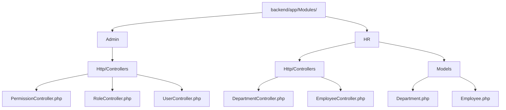
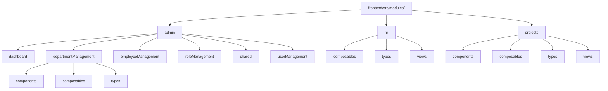
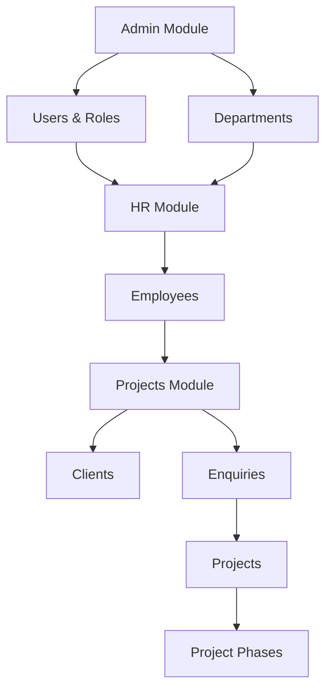
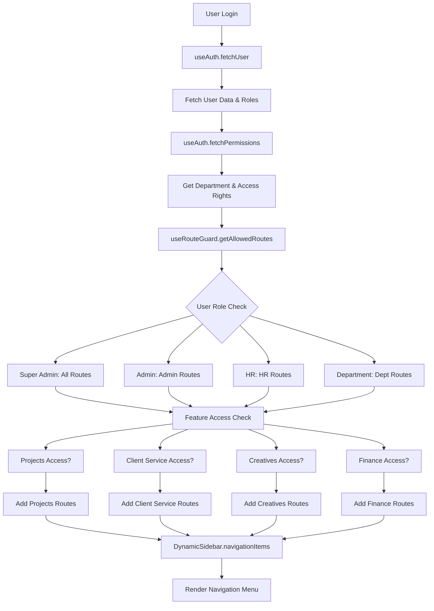

# Module Folder Structure Documentation

## Overview

This document provides a comprehensive breakdown of the folder structures for the Admin, HR, and Projects modules in both the backend (Laravel) and frontend (Vue.js) applications. It includes internal organization, file types, relationships, and naming conventions.

## Backend Module Structure

### Admin Module
**Location:** `backend/app/Modules/Admin/`

```
Admin/
├── Http/
│   └── Controllers/
│       ├── PermissionController.php
│       ├── RoleController.php
│       └── UserController.php
```

**File Types:**
- **Controllers:** PHP classes handling HTTP requests for permissions, roles, and users
- **Features:** CRUD operations for system administration entities

**Key Characteristics:**
- Uses Spatie Permission package for role-based access control
- Controllers follow RESTful conventions with index, show, store, update, destroy methods
- JSON responses with consistent structure

### HR Module
**Location:** `backend/app/Modules/HR/`

```
HR/
├── Http/
│   └── Controllers/
│       ├── DepartmentController.php
│       └── EmployeeController.php
├── Models/
│   ├── Department.php
│   └── Employee.php
```

**File Types:**
- **Controllers:** PHP classes for department and employee management
- **Models:** Eloquent models with relationships and business logic

**Key Characteristics:**
- Full CRUD operations with validation
- Relationships: Departments have managers and employees
- Pagination and filtering support
- Soft delete protection for departments with employees

### Projects Module
**Note:** No backend Projects module currently exists. This may be implemented in future development phases.

## Frontend Module Structure

### Admin Module
**Location:** `frontend/src/modules/admin/`

```
admin/
├── dashboard/
│   └── AdminDashboard.vue
├── departmentManagement/
│   ├── DepartmentManagement.vue
│   ├── components/
│   │   └── DepartmentForm.vue
│   ├── composables/
│   │   └── useDepartments.ts
│   └── types/
│       └── department.ts
├── employeeManagement/
│   ├── EmployeeManagement.vue
│   ├── composables/
│   │   └── useEmployees.ts
│   └── types/
│       └── employee.ts
├── roleManagement/
│   ├── RoleManagement.vue
│   ├── composables/
│   │   └── useRoles.ts
│   └── types/
│       └── role.ts
├── shared/
│   ├── composables/
│   │   └── useApi.ts
│   └── types/
│       └── common.ts
└── userManagement/
    ├── UserManagement.vue
    ├── components/
    │   └── UserForm.vue
    ├── composables/
    │   └── useUsers.ts
    └── types/
        └── user.ts
```

**File Types:**
- **Views (.vue):** Main page components for each management section
- **Components (.vue):** Reusable UI components (forms, etc.)
- **Composables (.ts):** Vue 3 composition functions for data management
- **Types (.ts):** TypeScript interfaces and type definitions

### HR Module
**Location:** `frontend/src/modules/hr/`

```
hr/
├── composables/
│   ├── useEmployees.ts
│   └── useUsers.ts
├── types/
│   └── employee.ts
└── views/
    ├── EmployeeManagement.vue
    └── HRDashboard.vue
```

**File Types:**
- **Views (.vue):** Dashboard and management pages
- **Composables (.ts):** Data fetching and state management
- **Types (.ts):** Employee data structures

### Projects Module
**Location:** `frontend/src/modules/projects/`

```
projects/
├── components/
│   ├── QuickActions.vue
│   ├── WorkflowGuide.vue
│   └── WorkflowStep.vue
├── composables/
│   ├── useClients.ts
│   ├── useEnquiries.ts
│   ├── useProjectPhases.ts
│   └── useProjects.ts
├── types/
│   ├── client.ts
│   ├── enquiry.ts
│   ├── index.ts
│   ├── materials.ts
│   ├── project.ts
│   ├── quotation.ts
│   └── siteSurvey.ts
└── views/
    ├── ClientsManagement.vue
    ├── EnquiriesManagement.vue
    ├── EnquiryDetailWorkflow.vue
    ├── MaterialsManagement.vue
    ├── ProjectsDashboard.vue
    ├── ProjectsManagement.vue
    ├── SiteSurveysManagement.vue
```

**File Types:**
- **Views (.vue):** Management pages for different project aspects
- **Components (.vue):** Workflow and action components
- **Composables (.ts):** Specialized data management for project lifecycle
- **Types (.ts):** Comprehensive type definitions for project entities

## Module Hierarchies

### Backend Module Hierarchy


### Frontend Module Hierarchy


## Relationships Between Modules

### Data Flow Relationships


### Key Relationships:
1. **Admin → HR:** Admin manages departments and user roles that HR uses for employee assignments
2. **HR → Projects:** Employees from HR are assigned to projects
3. **Projects Flow:** Clients → Enquiries → Projects → Phases
4. **Shared Resources:** Common types and API utilities shared across modules

## Naming Conventions

### File Naming
- **Views:** PascalCase with descriptive names (e.g., `AdminDashboard.vue`, `EmployeeManagement.vue`)
- **Components:** PascalCase (e.g., `DepartmentForm.vue`, `QuickActions.vue`)
- **Composables:** camelCase with `use` prefix (e.g., `useEmployees.ts`, `useProjects.ts`)
- **Types:** camelCase matching the entity (e.g., `employee.ts`, `project.ts`)
- **Backend Controllers:** PascalCase with `Controller` suffix (e.g., `DepartmentController.php`)
- **Backend Models:** PascalCase (e.g., `Department.php`)

### Directory Naming
- **Modules:** lowercase (e.g., `admin`, `hr`, `projects`)
- **Subdirectories:** camelCase for feature-specific folders (e.g., `departmentManagement`, `userManagement`)
- **Special folders:** lowercase (e.g., `components`, `composables`, `types`, `views`)

## Organization Principles

### Separation of Concerns
- **Views:** Presentation logic and user interactions
- **Components:** Reusable UI elements
- **Composables:** Business logic and data management
- **Types:** Data structure definitions

### Feature-Based Organization
- Each module encapsulates related functionality
- Clear boundaries between admin, HR, and projects domains
- Shared utilities in dedicated folders

### Consistency Across Modules
- Similar structure patterns across all modules
- Standardized naming conventions
- Consistent API response formats
- Reusable composables and components

### Scalability Considerations
- Modular structure allows easy addition of new features
- TypeScript provides type safety and better IDE support
- Composition API enables reusable logic
- Clear separation facilitates testing and maintenance

This modular architecture ensures maintainability, scalability, and clear separation of business domains while maintaining consistency across the application.

---

# Dynamic Sidebar Architecture

## Overview

The Dynamic Sidebar is a role-based navigation component that provides contextual menu items based on user permissions, roles, and department access. It dynamically adapts its content and appearance based on the authenticated user's access level and organizational role.

## Core Components

### 1. DynamicSidebar.vue Component

**Location:** `frontend/src/components/DynamicSidebar.vue`

**Purpose:** Main sidebar component that renders navigation items and handles collapse/expand functionality.

**Key Features:**
- **Responsive Design:** Collapsible sidebar with smooth transitions
- **Dynamic Content:** Navigation items change based on user permissions
- **Contextual Branding:** Title and subtitle adapt to user role/department
- **Route Integration:** Uses Vue Router for navigation with active state highlighting

**Component Structure:**
```vue
<template>
  <aside :class="[collapsed ? 'w-16' : 'w-64']">
    <!-- Header with dynamic title/subtitle -->
    <div class="mb-8">
      <h2 :class="[collapsed ? 'opacity-0' : 'opacity-100']">
        {{ getSidebarTitle() }}
      </h2>
      <p :class="[collapsed ? 'opacity-0' : 'opacity-100']">
        {{ getSidebarSubtitle() }}
      </p>
    </div>

    <!-- Navigation Items -->
    <nav class="space-y-2">
      <RouterLink v-for="item in navigationItems" :key="item.path"
                  :to="item.path" :class="activeClasses">
        <span class="text-lg">{{ item.icon }}</span>
        <span :class="[collapsed ? 'opacity-0 w-0' : 'opacity-100']">
          {{ item.label }}
        </span>
      </RouterLink>
    </nav>
  </aside>
</template>
```

### 2. useAuth Composable

**Location:** `frontend/src/composables/useAuth.ts`

**Purpose:** Manages user authentication state, permissions, and user data.

**Key Data Structures:**
```typescript
interface User {
  id: number
  name: string
  email: string
  department_id?: number
  department?: { id: number; name: string }
  roles?: string[]
}

interface UserPermissions {
  can_access_admin: boolean
  can_access_hr: boolean
  can_manage_users: boolean
  can_manage_employees: boolean
  can_manage_departments: boolean
  can_view_reports: boolean
  accessible_departments: number[]
  user_department: { id: number; name: string } | null
}
```

**Authentication Flow:**
1. Login stores token and fetches user data
2. User data includes roles array (extracted from role relationships)
3. Permissions are fetched separately via `/api/user/permissions`
4. Department information is merged from permissions API

### 3. useRouteGuard Composable

**Location:** `frontend/src/composables/useRouteGuard.ts`

**Purpose:** Provides route access control and navigation item filtering logic.

**Core Functions:**

#### Access Control Functions
- `canAccessRoute(routeName: string)`: Checks if user can access specific routes
- `canAccessDepartment(departmentId: number)`: Verifies department access
- `canAccessProjects()`: Checks project management access
- `canAccessClientService()`: Verifies client service access
- `canAccessCreatives()`: Checks creative/design department access
- `canAccessFinance(requiredRoles: string[])`: Validates finance access

#### Navigation Logic
- `getAllowedRoutes()`: Returns filtered navigation items based on user permissions
- `redirectToAppropriateRoute()`: Redirects users to appropriate landing pages

## Navigation Item Structure

```typescript
interface NavigationItem {
  path: string      // Route path
  label: string     // Display label
  icon: string      // Emoji icon
}
```

## Permission-Based Navigation Logic

### Super Admin Access
**Routes Available:** All routes across all modules
```typescript
if (userRoles.includes('Super Admin')) {
  routes.push(
    // Admin routes
    { name: 'admin-dashboard', path: '/admin', label: 'Admin Dashboard', icon: '📊' },
    // HR routes
    { name: 'hr-dashboard', path: '/hr', label: 'HR Dashboard', icon: '👥' }
    // ... all other routes
  )
}
```

### Role-Based Access
**Admin Users:**
- Access to admin management functions
- User, employee, role, and department management

**HR Users:**
- Access to HR dashboard and employee management

**Department Users (Manager/Employee):**
- Access to their specific department dashboard
- Route: `/department/{departmentId}`

### Feature-Specific Access

#### Projects Access
**Conditions:**
- User has 'Super Admin' role, OR
- Belongs to 'projects' or 'project' department, OR
- Has project-specific roles: 'Project Officer', 'Project Lead', 'Project Manager'

**Available Routes:**
- Projects Dashboard (`/projects`)
- Client Management (`/projects/clients`)
- Enquiries (`/projects/enquiries`)
- Approved Projects (`/projects/projects`)
- Close-Out Report (`/projects/close-out-report`)

#### Client Service Access
**Conditions:**
- User has 'Super Admin' role, OR
- Has 'Client Service' role, OR
- Belongs to 'client service' or 'client-service' department

**Available Routes:**
- Client Service Dashboard (`/client-service`)
- Client Management (`/client-service/clients`)
- Enquiry Management (`/client-service/enquiries`)

#### Creatives Access
**Conditions:**
- User has 'Super Admin' role, OR
- Has 'Designer' role, OR
- Belongs to 'creatives', 'creative', or 'design' department

**Available Routes:**
- Design Department (`/creatives/design`)
- Enquiries (`/creatives/enquiries`)
- Element Templates (`/creatives/element-templates`)

#### Finance Access
**Conditions:**
- User has 'Super Admin' role, OR
- Has required finance roles: 'Accounts', 'Costing'

**Available Routes:**
- Finance Dashboard (`/finance`)
- Budget Management (`/finance/budgeting`)
- Cost Analysis (`/finance/costing`)
- Invoice Management (`/finance/invoicing`)
- Financial Reports (`/finance/reporting`)
- Project Enquiries (`/finance/enquiries`)
- Financial Analytics (`/finance/analytics`)

## Dynamic Branding Logic

The sidebar title and subtitle adapt based on user roles and department:

### Title Logic (`getSidebarTitle()`)
```typescript
const getSidebarTitle = (): string => {
  if (!user.value) return 'ERP System'

  const userRoles = user.value.roles || []

  if (userRoles.includes('Super Admin')) return 'Super Admin Panel'
  if (userRoles.includes('Admin')) return 'Admin Panel'
  if (userRoles.includes('HR')) return 'HR Panel'

  // Department-specific logic
  if (hasProjectsAccess) return 'Projects Panel'
  if (hasClientServiceAccess) return 'Client Service Panel'

  return permissions.value?.user_department?.name || 'ERP System'
}
```

### Subtitle Logic (`getSidebarSubtitle()`)
```typescript
const getSidebarSubtitle = (): string => {
  if (!user.value) return 'Management Dashboard'

  if (userRoles.includes('Super Admin')) return 'Full System Access'
  if (userRoles.includes('Admin')) return 'System Administration'
  if (userRoles.includes('HR')) return 'Human Resources'

  if (hasProjectsAccess) return 'Project Management'
  if (hasClientServiceAccess) return 'Client Acquisition & Marketing'

  return permissions.value?.user_department?.name ?
    'Department Dashboard' : 'Management Dashboard'
}
```

## Route Guard Integration

The sidebar integrates with Vue Router's navigation guards defined in `router/index.ts`:

```typescript
router.beforeEach(async (to, from, next) => {
  // Authentication check
  if (to.meta.requiresAuth) {
    const token = localStorage.getItem('auth_token')
    if (!token) return next('/login')
  }

  // Role-based access control
  if (to.meta.requiresRole) {
    // Allow access if authenticated (role checking handled by components)
  }

  // Department access control
  if (to.meta.requiresDepartment) {
    if (!canAccessDepartment(departmentId)) return next('/access-denied')
  }

  // Feature-specific access controls
  if (to.meta.requiresProjectsAccess) {
    if (!canAccessProjects()) return next('/dashboard')
  }
  // ... additional guards for client service, creatives, finance

  next()
})
```

## Data Flow Architecture



## Security Considerations

1. **Client-Side Filtering:** Navigation items are filtered on the client-side based on permissions
2. **Server-Side Validation:** All route access is validated server-side via API endpoints
3. **Token-Based Auth:** Authentication state maintained via JWT tokens
4. **Permission Caching:** User permissions cached in composable state
5. **Fallback Handling:** Graceful degradation when permissions fail to load

## Performance Optimizations

1. **Computed Properties:** Navigation items computed reactively based on user state
2. **Lazy Loading:** Route components loaded dynamically to reduce initial bundle size
3. **Efficient Re-renders:** Sidebar only re-renders when user state or collapse state changes
4. **Icon Optimization:** Uses emoji icons for fast rendering and small bundle size

## Extensibility

The architecture supports easy addition of new navigation items:

1. **Add Route:** Define new route in appropriate router module
2. **Update Permissions:** Add permission check in `useRouteGuard`
3. **Add Navigation Item:** Include in `getAllowedRoutes()` return array
4. **Test Access:** Verify role-based access control works correctly

This dynamic sidebar architecture provides a scalable, secure, and user-friendly navigation system that adapts to organizational structure and user permissions.